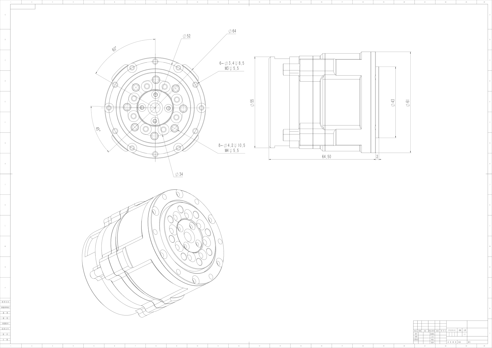
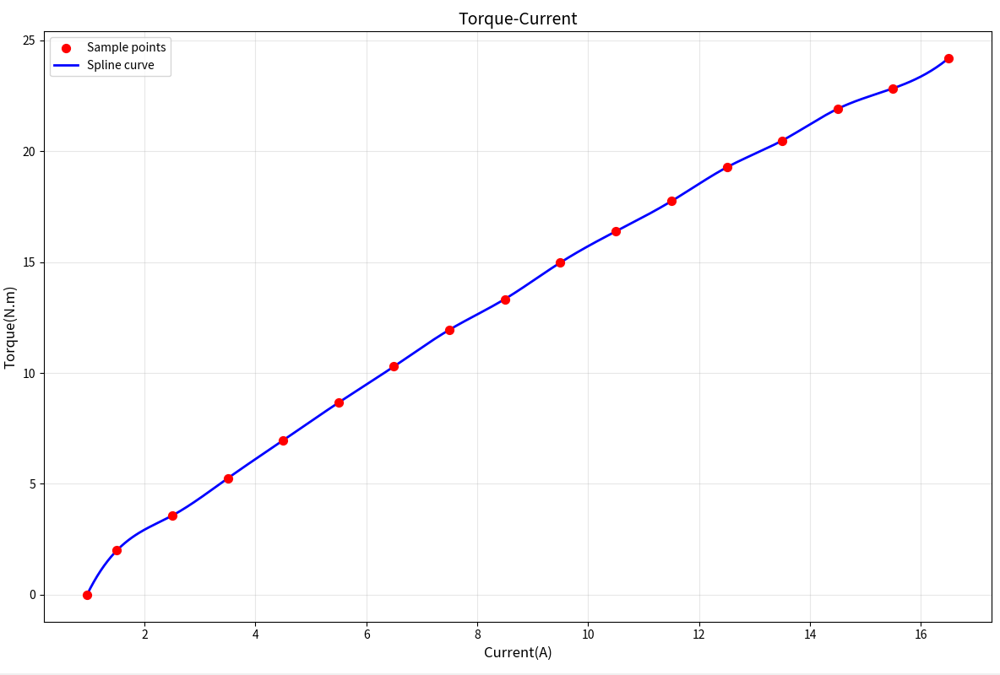

# BXI5014-19 Joint Motor

**BXI Hollow Planetary Series — Motor Specifications**

---

## Engineering Drawing

- **Mounting OD**: 64.00 mm
- **Height**: 66.50 mm
- **Hollow Bore**: 6 mm

---

## Specifications

| Parameter | Value | Unit |
| :--- | :--- | :--- |
| **Rated Voltage** | 24–48 | V |
| **No-load Speed** | 200 | RPM |
| **Rated Output Speed** | 100 | RPM |
| **Rated Torque** | 7 | Nm |
| **Peak Torque** | 25 | Nm |
| **Peak Phase Current** | 30 | A(rms) |
| **Gear Ratio** | 19.5 | — |
| **Moment of Inertia** | 0.00424198 | kg·m² |
| **Weight** | 0.5 | kg |

> **Note**: All parameters above are theoretical values and may vary under actual operating conditions.

---

## Interface & Sensor Definitions

| Item | Specification |
| :--- | :--- |
| **Communication** | CAN / CANFD |
| **Protocol** | MIT Protocol Compatible |
| **Control Mode** | Mixed Torque / Velocity / Position |
| **Bearing Type** | Cross Roller Bearing |
| **Dual Absolute Encoder** | Supported |
| **Input Encoder** | Magnetic Encoder |
| **Output Encoder** | Inductive Encoder |

---

## Performance Curves

**Torque–Current Curve**

**Torque–Speed Curve**

---

## Application in Elf3

BXI5014-19 drives the shoulder rotation, wrist, and neck joints of Elf3 — the lightest-load joints across the full body:

| Joint | Min (rad) | Max (rad) | Peak Torque (Nm) | Peak Speed (rad/s) | Inertia (kg·m²) |
| :--- | :---: | :---: | :---: | :---: | :---: |
| l/r_shoulder_z_joint | −2.8798 | 2.8798 | 21 | 20 | 0.00424198 |
| l/r_wrist_x_joint | −2.8798 | 2.8798 | 21 | 20 | 0.00424198 |
| l/r_wrist_y_joint | −1.309 | 1.309 | 21 | 20 | 0.00424198 |
| l/r_wrist_z_joint | −0.7854 | 0.7854 | 21 | 20 | 0.00424198 |
| neck_z_joint | −1.57 | 1.57 | 21 | 20 | 0.00424198 |
| neck_y_joint | −0.7854 | 0.7854 | 21 | 20 | 0.00424198 |

---

> Specifications are subject to change before official release. For more information, visit [x.com/bxirobotics](https://x.com/bxirobotics) or contact contact@bxirobotics.com.
