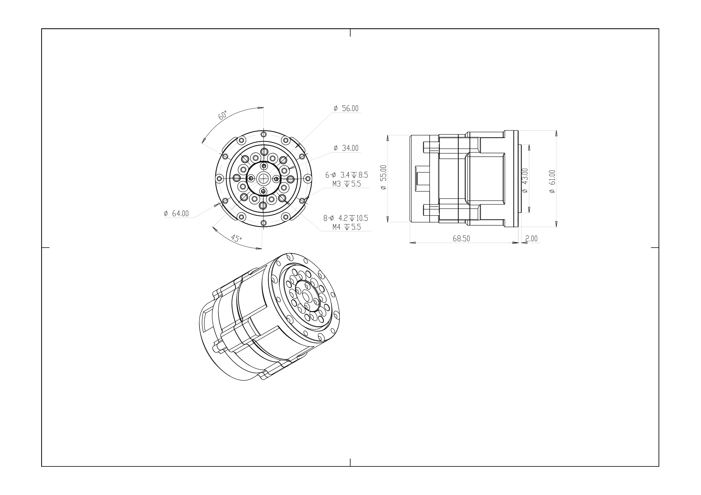

# BXI5018-19 Joint Motor

**BXI Hollow Planetary Series — Motor Specifications (BXI50 Long Version)**

---

## Engineering Drawing

- **Mounting OD**: 64.00 mm
- **Height**: 70.50 mm
- **Hollow Bore**: 6 mm

---

## Specifications

| Parameter | Value | Unit |
| :--- | :--- | :--- |
| **Rated Voltage** | 24–48 | V |
| **No-load Speed** | 200 | RPM |
| **Rated Output Speed** | 100 | RPM |
| **Rated Torque** | 11 | Nm |
| **Peak Torque** | 35 | Nm |
| **Peak Phase Current** | 30 | A(rms) |
| **Gear Ratio** | 19.5 | — |
| **Weight** | 0.55 | kg |

> **Note**: All parameters above are theoretical values and may vary under actual operating conditions.

---

## Interface & Sensor Definitions

| Item | Specification |
| :--- | :--- |
| **Communication** | CAN / CANFD |
| **Protocol** | MIT Protocol Compatible |
| **Control Mode** | Mixed Torque / Velocity / Position |
| **Bearing Type** | Cross Roller Bearing |
| **Dual Absolute Encoder** | Supported |
| **Input Encoder** | Magnetic Encoder |
| **Output Encoder** | Inductive Encoder |

---

## Application in Elf3

BXI5018-19 drives the ankle joints of Elf3, with two motors running in parallel per axis to deliver higher combined output torque:

| Joint | Min (rad) | Max (rad) | Peak Torque (Nm) | Peak Speed (rad/s) | Inertia (kg·m²) |
| :--- | :---: | :---: | :---: | :---: | :---: |
| l/r_ankle_y_joint (dual motor) | −0.87266 | 0.7854 | 40 | 20 | 0.00848397 |
| l/r_ankle_x_joint (dual motor) | −0.34907 | 0.34907 | 15 | 20 | 0.00551458 |

---

> Specifications are subject to change before official release. For more information, visit [x.com/bxirobotics](https://x.com/bxirobotics) or contact contact@bxirobotics.com.
