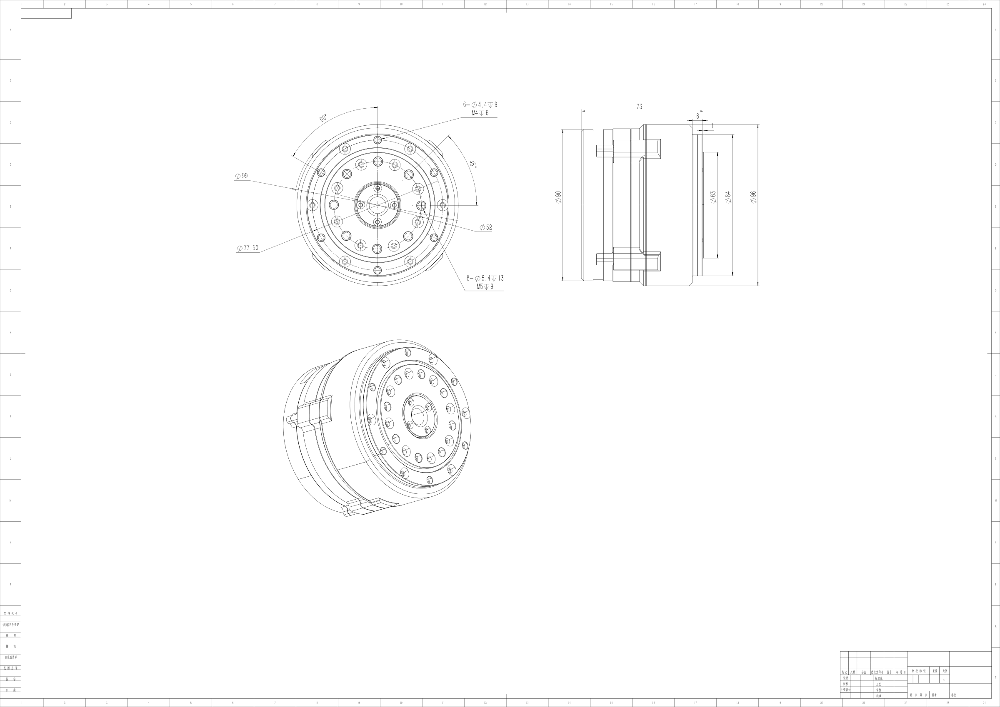
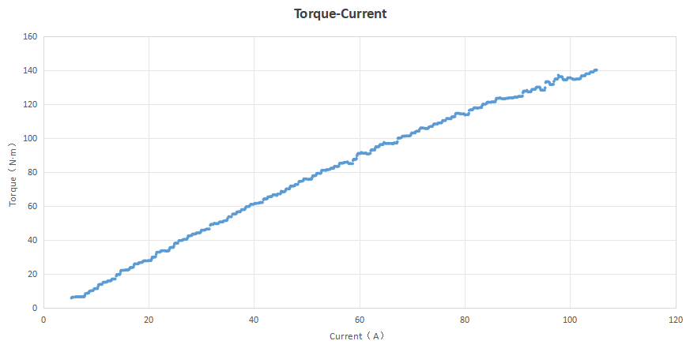

# BXI8515-19 Joint Motor

**BXI Hollow Planetary Series — Motor Specifications**

---

## Engineering Drawing

- **Mounting OD**: 99.00 mm
- **Height**: 73.00 mm
- **Hollow Bore**: 10 mm

---

## Specifications

| Parameter | Value | Unit |
| :--- | :--- | :--- |
| **Rated Voltage** | 24–48 | V |
| **No-load Speed** | 200 | RPM |
| **Rated Output Speed** | 100 | RPM |
| **Rated Torque** | 40 | Nm |
| **Peak Torque** | 150 | Nm |
| **Peak Phase Current** | 90 | A(rms) |
| **Gear Ratio** | 19.5 | — |
| **Moment of Inertia** | 0.044688 | kg·m² |
| **Weight** | 1.4 | kg |

> **Note**: All parameters above are theoretical values and may vary under actual operating conditions.

---

## Interface & Sensor Definitions

| Item | Specification |
| :--- | :--- |
| **Communication** | CAN / CANFD |
| **Protocol** | MIT Protocol Compatible |
| **Control Mode** | Mixed Torque / Velocity / Position |
| **Bearing Type** | Cross Roller Bearing |
| **Dual Absolute Encoder** | Supported |
| **Input Encoder** | Magnetic Encoder |
| **Output Encoder** | Inductive Encoder |

---

## Performance Curves

**Torque–Current Curve**

**Torque–Speed Curve**

---

## Application in Elf3

With a 150 Nm peak torque, BXI8515-19 drives the high-load leg and waist joints of the Elf3 humanoid robot:

| Joint | Range (rad) | Peak Torque (Nm) | Peak Speed (rad/s) | Inertia (kg·m²) |
| :--- | :---: | :---: | :---: | :---: |
| waist_z_joint | −2.8798 ～ 2.8798 | 150 | 20 | 0.044688 |
| l/r_hip_y_joint | −2.8798 ～ 2.8798 | 150 | 20 | 0.044688 |
| l_hip_x_joint | −0.48869 ～ 3.0543 | 150 | 20 | 0.044688 |
| r_hip_x_joint | −3.0543 ～ 0.48869 | 150 | 20 | 0.044688 |
| l/r_knee_y_joint | −0.087266 ～ 2.618 | 150 | 20 | 0.044688 |

---

> Specifications are subject to change before official release. For more information, visit [x.com/bxirobotics](https://x.com/bxirobotics) or contact contact@bxirobotics.com.
