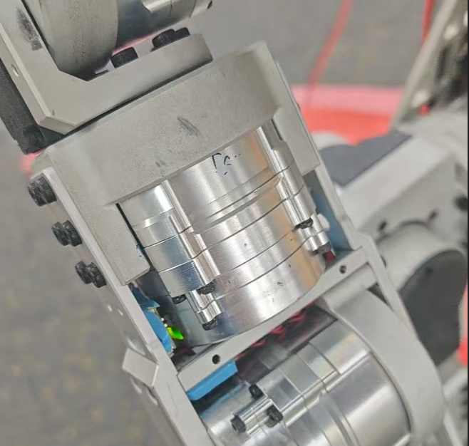
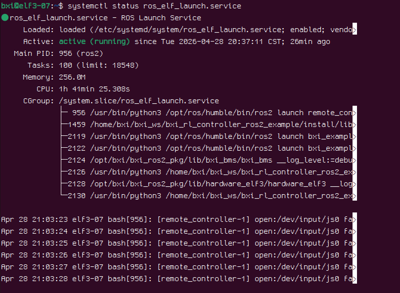

# 运动控制开发指南

本文档包含 精灵3 机器人运动控制开发说明。

---

## 机器人的使用
```
#机器人主控的根目录下有bxi_ws文件夹，里面带有机器人的运动控制程序

#附项目的原地址,请仔细阅读readme.md
https://github.com/bxirobotics/bxi_rl_controller_ros2_example
```
## 启动机器人程序
- 启动仿真程序
```
source /opt/bxi/bxi_ros2_pkg/setup.bash
cd bxi_ws/bxi_rl_controller_ros2_example
source install/setup.bash
ros2 launch bxi_example_py_elf3 example_launch_demo.py
```
- 启动真机程序（注意安全）
```
# 需要和机器人电机交互的程序因为权限问题都需要进入root

# 进入root
sudo su 

source /opt/bxi/bxi_ros2_pkg/setup.bash
cd /home/bxi/bxi_ws/bxi_rl_controller_ros2_example
source install/setup.bash
ros2 launch bxi_example_py_elf3 example_launch_demo_hw.py
```
<br>
启动后电机会上电,观察全身电机会有绿灯,机器人会进入自检，如果6s左右后绿灯没有熄灭说明自检通过<br>
- 启动遥控器程序
```
#真机
sudo su 
source /opt/bxi/bxi_ros2_pkg/setup.bash
cd /home/bxi/bxi_ws/bxi_rl_controller_ros2_example
source install/setup.bash
ros2 launch remote_controller remote_conroller_launch.py 

#仿真
source /opt/bxi/bxi_ros2_pkg/setup.bash
cd ~/bxi_ws/bxi_rl_controller_ros2_example
source install/setup.bash
ros2 launch remote_controller remote_conroller_launch.py 

```
# 常见问题
### 1.如何关闭后台遥控器服务
机器人上电的时候会自动启动遥控器服务方便平常调试与演示<br>
- 查询服务状态
```
systemctl status ros_elf_launch.service
```
<br>
关掉它有以下办法<br>
- 暂时关闭
```
systemctl stop ros_elf_launch.service
```
- 再启动
```
systemctl start ros_elf_launch.service
```
- 永久关闭
```
systemctl stop ros_elf_launch.service
sudo systemctl disable ros_elf_launch.service
#这个会禁用开机自启
```
### 2.真机程序启动失败后日志查看

- 官方程序会把日志放在 /var/log/bxi_log路径内，按照时间排序

