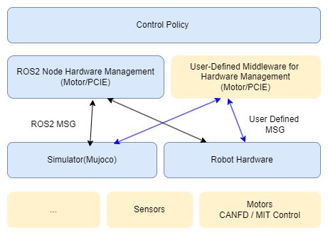

# Control System Architecture

BXI provides a full-stack open architecture:

- CANFD-based motor hardware control and debugging interfaces
- MuJoCo-based simulation environments, robot URDF/XML resources, and related assets
- ROS2-based hardware management nodes, allowing control policies to be deployed seamlessly to simulation and real hardware
- Reinforcement-learning-based motion control training example code

## Documentation Directory

- ROS2-based control policy deployment framework with seamless deployment to simulation and real hardware: <https://github.com/bxirobotics/bxi_rl_controller_ros2_example>
- Robot URDF resources: <https://github.com/bxirobotics/bxi_rl_controller_ros2_example/tree/main/resources>
